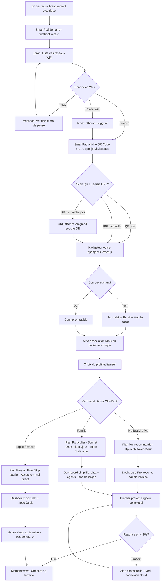
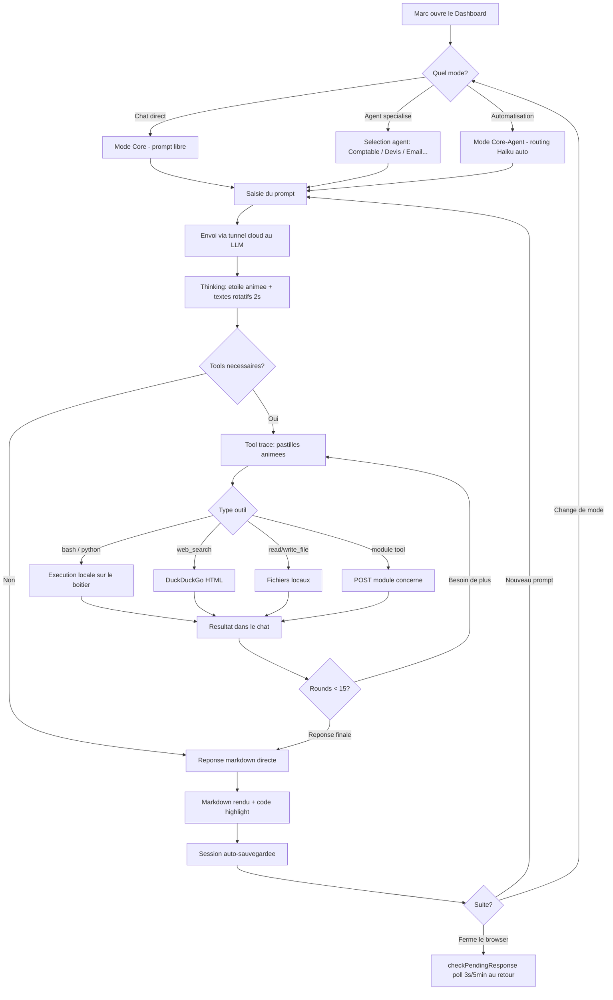
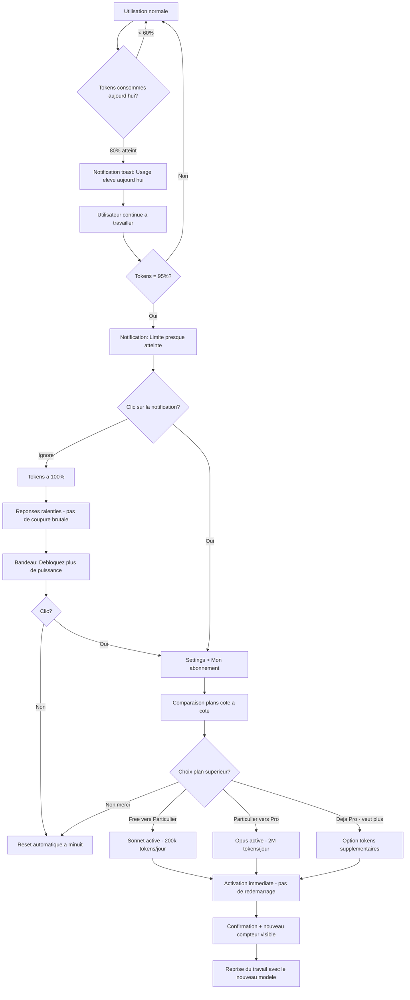
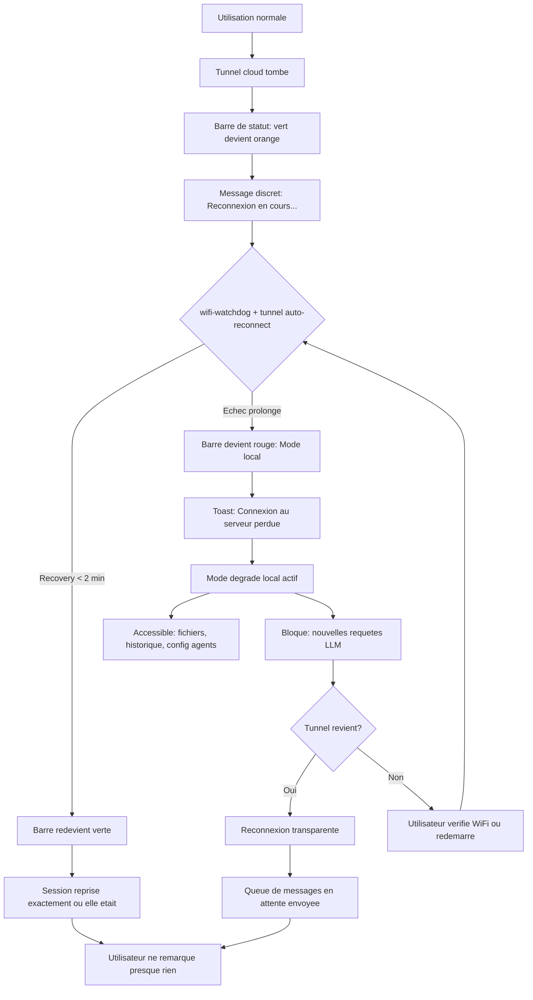

# UX Design Specification ClawBot

**Author:** Nicolas
**Date:** 2026-03-08

---

## Executive Summary

### Project Vision

ClawBot est un boitier IA agentique turnkey qui democratise l'acces a l'intelligence artificielle. Brancher, scanner le QR code, c'est pret en moins de 10 minutes. Le hardware materialise l'IA et la rend tangible — le Nest de l'IA domestique.

L'architecture repose sur ClawbotCore, un aggregateur pur (pattern Moonraker) qui route les requetes LLM et expose des modules independants. Le produit cible les professionnels (Phase 2) puis les particuliers (Phase 3).

4 principes UX fondateurs :
1. Zero friction — ne jamais demander ce qu'on peut deviner
2. Donnees locales par defaut — sans en parler
3. Show, don't tell — premiere valeur en <10 min
4. Le boitier est invisible — l'utilisateur pense a ce que l'IA fait, pas au hardware

### Vision UX Fondamentale : "Un bouton, ca marche"

L'utilisateur ne voit RIEN de la technique. Zero.

- **Pas de modes de chat** (Core/Agent/Core-Agent) — UNE seule zone de texte. Tu parles, ca marche.
- **Pas de selection de modele** (Haiku/Sonnet/Opus) — routing invisible. On agrege, on route, l'utilisateur ne sait pas et ne veut pas savoir.
- **PicoClaw sera retire** — ClawbotCore prend tout en charge. Le user n'a jamais vu PicoClaw et ne le verra jamais.
- **Pas de jargon technique** — pas de "tokens", pas de "LLM", pas de "agent". L'utilisateur voit : "ton assistant", "tes taches", "tes fichiers".
- **Plus puissant que ChatGPT** — pas juste du chat, le systeme EXECUTE : genere des documents telechargeables, cree des outils locaux, debugue des logiciels, convertit des videos, code des sites web. Il propose et il fait.

L'analogie : un cerveau supplementaire. Tu lui parles comme a un collegue. Il fait le travail. Tu ne sais pas s'il utilise Claude, DeepSeek, OpenAI ou Qwen derriere. Tu t'en fiches. Ca marche.

| Element technique (cache) | Ce que l'utilisateur voit |
|---------------------------|--------------------------|
| 3 modes chat (Core/Agent/Core-Agent) | 1 zone de texte unique |
| Boutons Haiku/Sonnet/Opus | Rien — routing automatique |
| "Tokens consommes : 45k/200k" | "Utilisation : 23%" (barre douce) |
| "Tool call: system__bash" | "En train de travailler..." avec spinner |
| "Context compaction triggered" | Invisible — en fond |
| Model bar technique | Absent |

Ce qui reste visible : spinner/throbber, streaming texte token par token, resultats (fichiers, documents, reponses), notifications ("Tache terminee", "Fichier pret"), trace simplifiee ("En train de chercher...", "En train de coder...", "En train de verifier...").

**Mode Geek (optionnel, cache)** : toggle dans les settings pour les devs/early adopters. Deverrouille : model bar, tool trace detaille, logs, context bar technique.

### Target Users

**Marc (Pro)** — Entrepreneur 42 ans, 8 salaries, gere tout seul, 60h/semaine. Veut puissance x10 : devis en 10s, emails classes, compta automatisee. Budget €200-600/mois. Utilise : dashboard (bureau), app mobile (deplacement), SmartPad kiosk (bureaux), desktop widget (pilotage PC).

**Sophie (Famille)** — Mere 38 ans, 2 enfants, mi-temps. Veut se simplifier la vie : planning repas, devoirs, budget familial. Budget €8/mois. Utilise : dashboard (cuisine), app mobile, SmartPad avatar (visage du boitier).

**Nicolas (Admin)** — Ops, gere la flotte de boitiers. Dashboard admin separe (URL/serveur dedie), monitoring, SSH distant, OTA, alerting.

**Thomas (Dev modules)** — Communaute, createur de modules et agents. SDK, manifest.json, test local, soumission au store.

### Surfaces UX (7 surfaces de design)

| # | Surface | Description | Phase |
|---|---------|-------------|-------|
| 1 | **Dashboard unifie (web = local)** | Meme SPA, acces LAN ou via openjarvis.io. Detection locale possible pour redirect. Une seule interface, deux points d'acces. | MVP |
| 2 | **App mobile** | App dediee, interface principale en mobilite. Remplace progressivement Telegram. | Growth |
| 3 | **SmartPad Avatar** | Petit ecran, animation de visage/personnage reactif aux taches (idle, travail, erreur, notification). Le "visage" du boitier, pas interactif. | MVP Pro |
| 4 | **SmartPad Kiosk** | Grand ecran tactile mural (entree bureau, cuisine, open space). Notifications, post-its, memos, infos push. Interface interactive complete. | Growth |
| 5 | **Telegram (+ integrations)** | Bridge messaging existant. Transitoire. | MVP |
| 6 | **Admin dashboard** | URL et serveur separes. Gestion flotte, users, devices, stats. PAS dans le dashboard user. | Growth |
| 7 | **Desktop widget** | Fenetre/modale flottante redimensionnable sur l'ecran PC. Chat + pilotage desktop. Jarvis dans le coin de l'ecran — minimise = indicateur discret, deplie = chat complet + commandes. | Vision |

### Interactions UX Obligatoires

- **Spinner/throbber** : present dans chaque interaction qui attend une reponse (envoi message, chargement panel, installation module, OTA, toute action async)
- **Pipeline streaming** : texte genere token par token en temps reel (pattern Anthropic/Claude.ai). Jamais de bloc de texte qui apparait d'un coup
- **Thinking indicator** : animation pendant la reflexion IA, remplacee par le vrai message backend quand disponible
- **Tool trace simplifie** : "En train de chercher...", "En train de coder...", "En train de verifier..." avec spinner (pas de noms d'outils techniques sauf en mode Geek)

### Assistants Specialises & Planification

**Assistants (terme user pour "agents") :**
- L'utilisateur cree des "assistants" — nom, description en langage naturel, avatar
- Pas de system_prompt visible — l'utilisateur decrit ce qu'il veut, le systeme genere le prompt technique
- Le systeme choisit automatiquement quel assistant utiliser selon la demande
- **Systeme de slots** : l'abo de base inclut X slots (ex: 5 Particulier, 15 Pro). Pack +10 slots = +€5/mois

**Planification de taches :**
- "Fais ca toutes les heures / tous les jours / tous les lundis a 9h"
- Interface calendrier/liste simple — pas de cron, pas de syntaxe
- Chaque tache planifiee consomme des tokens → visible dans l'utilisation
- Historique : "Rapport quotidien — execute aujourd'hui a 8h — OK"

### Credential Vault (Mes Acces)

**Panel "Mes acces" dans le dashboard :**
- "Ajouter un acces" → nom, identifiant, mot de passe
- Cadenas + "Stocke localement sur ton boitier, chiffre"
- L'IA demande confirmation avant d'utiliser un acces
- Module 1Password optionnel pour import depuis un vault existant

**Pattern securite : le LLM ne voit JAMAIS le vrai mot de passe :**
1. User stocke → `vault.set("serveur_ssh", "MonVraiMdp!")`
2. L'IA voit → `vault://serveur_ssh` (reference, jamais la valeur)
3. L'IA genere → commande avec `credential_ref: "serveur_ssh"`
4. ClawbotCore → intercepte, remplace la reference par le vrai mot de passe
5. Execution → locale sur le boitier avec le vrai mdp
6. Resultat → renvoye au LLM avec le mot de passe REDACTE

Chiffrement AES-256 (pycryptodome). Cle derivee du MAC du boitier + secret local — si on vole la SD, on ne peut pas dechiffrer sans le boitier physique. Zero transit cloud.

### Store / Marketplace

**Deux catalogues :**

| Catalogue | Contenu | Exemples | Modele economique |
|-----------|---------|----------|-------------------|
| **Agent Store** | Assistants specialises (prompts + skills + config) | "Agent Comptable", "Agent Immobilier", "Agent Juridique" | Gratuit ou payant (€1-10 one-shot ou inclus dans l'abo) |
| **Module Store** | Modules techniques (code + manifest + service) | "Module Orange", "Module Free/SFR", "Module 1Password", "Module MQTT" | Gratuit (entreprises qui veulent etre integrees) ou payant (devs communaute) |

**Agent Store :**
- Browse par categories : Productivite, Finance, Maison, Dev, Services...
- "Installer" en un clic → occupe un slot
- Indicateur de slots : "3/5 assistants utilises" avec bouton upgrade
- Les entreprises et devs tiers peuvent publier des agents (validation/moderation)

**Module Store :**
- Entreprises developpent leur module avec notre SDK (Orange, Free, EDF, banques...)
- L'utilisateur installe depuis le store, le module apparait dans le dashboard
- L'IA peut interagir avec l'API du module nativement
- Win-win : l'entreprise a un canal vers ses clients via l'IA, on enrichit l'ecosysteme

**Upsell naturel :** L'utilisateur decouvre un super agent dans le store → il a besoin d'un slot → il upgrade son abo. Cout pour nous = zero.

### Modele Economique "Netflix"

L'abonnement est un forfait — des mois l'utilisateur consomme beaucoup, des mois presque rien. Il paye pour la disponibilite, pas l'usage exact. Nous on est gagnants sur la moyenne.

Consequence UX : pas de compteur de tokens anxiogene. Jauge douce "utilisation ce mois" sans stress. Le throttle en fin de quota ralentit au lieu de couper — l'utilisateur ne se sent jamais bloque.

### Existant UX (Dashboard actuel)

Le dashboard SPA existe et fonctionne (~2500 lignes vanilla JS) :
- Design : dark theme cyan (#00ffe0), Outfit + JetBrains Mono, responsive 768px
- 3 modes chat existants (Core/Agent/Core-Agent) → seront fusionnes en un seul pour l'utilisateur
- Sessions : stockees serveur, persistence entre sessions
- File attachment : texte only, max 100KB
- 4 agents par defaut : python-dev, sysadmin, web-researcher, file-manager
- Slash commands : /clear, /help

### Key Design Challenges

1. **"Un bouton, ca marche"** — toute la complexite technique (routing LLM, selection d'agent, compaction contexte) doit etre 100% invisible. L'utilisateur tape, le systeme fait.

2. **Deux profils radicalement differents** — Marc veut de la puissance. Sophie veut de la simplicite. Le mode Safe/Pro transforme l'UX sans limiter. Mode Geek cache pour les devs.

3. **7 surfaces coherentes** — du petit ecran SmartPad Avatar au grand kiosk, en passant par le mobile et le desktop widget. Identite visuelle unifiee, interactions adaptees a chaque forme.

4. **L'onboarding QR doit etre magique** — scan → compte → mode → premiere reponse utile. Viser <5 min ressenti.

5. **Store/Marketplace** — decouverte d'agents et modules, installation en un clic, systeme de slots, moderation.

6. **Credential vault invisible** — securite maximale (AES-256, secret substitution) avec UX minimale (cadenas, "c'est securise chez toi").

7. **SmartPad : deux experiences distinctes** — Avatar (petit, reactif, emotionnel) vs Kiosk (grand, interactif, post-its, notifications).

### Design Opportunities

1. **L'effet drogue comme pattern UX** — premiere interaction = resultat spectaculaire. Guided first prompt, zero latence percue (streaming + thinking animation).

2. **Le boitier physique = confiance tangible** — SmartPad Avatar comme "visage" emotionnel de l'IA. Lien affectif que le SaaS ne peut pas creer.

3. **Progressive disclosure naturelle** — panels absents si module pas installe. Interface demarre minimaliste et grandit avec l'utilisateur et ses slots d'agents.

4. **Tool trace comme spectacle** — voir l'IA "travailler" cree de la confiance ET du divertissement. Differenciant vs ChatGPT (boite noire).

5. **Post-its SmartPad Kiosk** — notes collaboratives familiales/bureau, unique dans le segment.

6. **Desktop widget = Jarvis toujours la** — fenetre flottante minimale, toujours accessible, pilotage PC.

7. **Store comme effet reseau** — chaque agent/module ajoute rend la plateforme plus precieuse. Les entreprises qui integrent leur service creent un ecosysteme auto-entretenu.

## Core User Experience

### Defining Experience

La boucle fondamentale de ClawBot est : **demande → execution → resultat tangible**.

L'utilisateur exprime un besoin en langage naturel. Le systeme comprend, execute, et livre un resultat concret — un fichier, une action, une reponse structuree. Pas du chat passif. De l'action.

**Boucle core :**
1. L'utilisateur tape ou parle sa demande dans une zone de texte unique
2. ClawbotCore route invisiblement (choix du modele, de l'assistant, du mode)
3. L'IA travaille — l'utilisateur VOIT qu'elle travaille (spinner, trace simplifiee, streaming)
4. Resultat tangible : document telechargeble, tache executee, reponse actionnable
5. L'utilisateur enchaine ou planifie — le systeme apprend ses preferences

Le differenciateur : la ou ChatGPT repond, ClawBot **fait**. Generer un devis PDF, classer 200 emails, coder un script, convertir une video — pas juste en parler, le faire.

### Platform Strategy

| # | Surface | Input | Output | Specificite |
|---|---------|-------|--------|-------------|
| 1 | **Dashboard unifie** | Texte, fichiers (drag & drop), voice (futur) | Texte streaming, fichiers telechargeables, panels dynamiques | Interface principale, toutes les features |
| 2 | **App mobile** | Texte, photo, voice | Notifications push, resultats inline, partage | En mobilite, quick actions |
| 3 | **SmartPad Avatar** | Aucun (display only) | Animations faciales, etats emotionnels | Presence physique, lien affectif |
| 4 | **SmartPad Kiosk** | Touch, post-its, swipe | Notifications, memos, infos push, agenda | Mural, partageable, familial/bureau |
| 5 | **Telegram** | Texte, photos, fichiers | Texte, fichiers | Bridge transitoire, sera remplace par l'app |
| 6 | **Admin dashboard** | Formulaires, CLI | Stats, monitoring, alertes | Serveur separe, ops only |
| 7 | **Desktop widget** | Texte, raccourcis clavier | Reponses inline, pilotage desktop | Toujours accessible, minimisable |

**Strategie de coherence** : meme design system (dark cyan, Outfit/JetBrains Mono), meme API backend, meme session utilisateur. L'utilisateur passe du dashboard au mobile au kiosk sans friction — sa session le suit.

### Effortless Interactions

5 interactions qui doivent etre zero-friction, zero-reflexion :

1. **Onboarding QR** — Brancher le boitier, scanner le QR, creer le compte, premiere reponse utile. Temps cible : <5 min ressenti. Zero config manuelle. Le boitier detecte le reseau, se connecte, s'enregistre. L'utilisateur ne voit que : scan → nom → premiere question.

2. **Premiere requete** — L'utilisateur tape sa premiere demande. Pas de tutorial, pas de guide, pas de "choisissez votre mode". Il tape, ca marche. Le guided first prompt suggere une action spectaculaire adaptee au profil (Pro : "Genere-moi un devis pour...", Famille : "Planifie les repas de la semaine").

3. **Credential vault** — "Ajouter un acces" → nom + identifiant + mot de passe → cadenas. C'est tout. L'IA utilise les acces quand necessaire avec confirmation. L'utilisateur ne sait pas que le LLM ne voit jamais le vrai mot de passe — il sait juste que c'est "stocke chez lui, chiffre".

4. **Installation agent/module** — Browse le store → "Installer" → c'est pret. Un clic. L'agent apparait dans la liste, le module s'active. Pas de configuration, pas de redemarrage, pas de "attention, ca consomme des tokens".

5. **Planification de tache** — "Fais ca tous les jours a 8h" → c'est planifie. L'utilisateur voit la liste de ses taches planifiees, leur historique, leur statut. Pas de cron, pas de syntaxe, pas de "selectionnez un creneau".

### Critical Success Moments

4 moments make-or-break qui determinent le succes ou l'echec du produit :

1. **Le moment "wow" initial** — Les 30 premieres secondes apres la premiere requete. L'utilisateur voit le streaming token par token, la trace simplifiee ("En train de chercher...", "En train de coder..."), et recoit un resultat concret. S'il dit "c'est mieux que ChatGPT" → gagne. S'il dit "c'est pareil" → perdu.

2. **Le moment "il a compris"** — Quand l'IA utilise le contexte de sessions precedentes, connait les preferences, et anticipe. Marc demande "le meme devis que la derniere fois mais pour Dupont" → l'IA sait exactement de quoi il parle. Le systeme apprend, pas l'utilisateur.

3. **Le moment "ca juste marche"** — L'utilisateur demande quelque chose de complexe (connecte-toi a mon serveur et deploie le code). Le credential vault, le routing LLM, la selection d'outil — tout est invisible. Il voit juste : "En train de se connecter..." → "Deploiement termine. Voici le rapport." Zero friction technique.

4. **Le moment "je reviens"** — La premiere fois que l'utilisateur revient apres 24h. Sa session est la. Ses taches planifiees ont tourne. "Rapport quotidien — execute ce matin a 8h — OK". Le boitier a travaille pendant qu'il dormait. La valeur est continue, pas ponctuelle.

### Experience Principles

5 principes directeurs pour toutes les decisions UX de ClawBot :

1. **"Tu parles, ca fait"** — Chaque interaction doit produire un resultat tangible, pas juste une reponse. L'IA execute, genere, cree, deploie. Le chat n'est pas la destination, c'est le declencheur.

2. **"Zero choix technique"** — L'utilisateur ne choisit jamais un modele, un mode, un outil. Le systeme route, optimise, selectionne. La seule decision de l'utilisateur : quoi demander.

3. **"Vivant, pas mort"** — Chaque interaction montre que le systeme travaille. Spinner, streaming, trace simplifiee, animations SmartPad. Jamais d'ecran fige, jamais de "chargement..." sans vie. Le boitier respire.

4. **"Chez toi, pour toi"** — Les donnees sont locales. Les mots de passe ne quittent pas le boitier. L'IA connait ton contexte, tes preferences, ton historique — parce que tout est chez toi, pas dans un cloud anonyme.

5. **"Grandit avec toi"** — L'interface demarre minimaliste et s'enrichit. Nouveaux assistants, nouveaux modules, nouvelles taches planifiees. Progressive disclosure naturelle. L'utilisateur ne voit jamais plus que ce dont il a besoin aujourd'hui.

## Desired Emotional Response

### Primary Emotional Goals

**Emotion primaire : "Incroyable — ca va changer ma vie"**

ClawBot n'est PAS un outil de productivite. C'est un outil de **recuperation de vie**. La nuance est fondamentale et positionne la marque :

| Marque productivite (PAS nous) | Marque vie (ClawBot) |
|-------------------------------|----------------------|
| "Fais plus de taches" | "Recupere ton temps" |
| "Sois plus efficace" | "Vis mieux" |
| "Gagne plus d'argent" | "Rentre plus tot le soir" |
| "Automatise ton workflow" | "Ne t'embrouille plus avec ton conjoint" |
| KPI : taches/heure | KPI : heures recuperees/semaine |

**Marc** ne dit pas "je traite 3x plus de devis". Il dit : **"J'ai plus de temps avec mes enfants."** Il rentre a 18h au lieu de 21h. Il ne s'engueule plus avec son assistante. Le boulot est fait, bien fait, sans friction.

**Sophie** ne dit pas "je suis mieux organisee". Elle dit : **"Je ne m'embrouille plus avec mon conjoint."** La liste de courses remonte automatiquement. Les rappels sont contextuels. Le planning repas est fait. Le mental load disparait.

**Split emotionnel famille/enterprise :** meme phrase ("ca change ma vie") mais chemin different. Sophie → soulagement (le mental load disparait). Marc → puissance tranquille (le business tourne, il recupere sa vie). Les deux convergent vers : "j'ai retrouve du temps".

### Emotional Journey Mapping

**Decouverte** → "C'est quoi ce truc ?" (curiosite)
**Premiere utilisation** → "Attends... il a VRAIMENT fait ca ?" (emerveillement)
**Semaine 1** → "J'ai recupere 2h hier" (prise de conscience)
**Mois 1** → "Je ne pourrais plus m'en passer" (dependance positive)
**Recommandation** → "Achete ca, ca va changer ta vie — pour 7€/mois" (evangelisation)

Le mot-cle de la recommandation : **"ca va changer ta vie"**. Pas "c'est un bon outil". Pas "c'est pratique". **Changer ta vie.** C'est l'emotion qui fait vendre sans budget marketing.

**Scenario emotionnel Sophie :**
Sophie a configure la liste de courses partagee. Son conjoint arrive pres du supermarche → notification push avec la liste exacte que Sophie a mise a jour. Plus de SMS "tu peux passer acheter...", plus de "t'as oublie le lait". Le systeme detecte la geolocalisation, pousse l'info au bon moment. Le SMS devient obsolete pour la coordination familiale.

**Scenario emotionnel Marc (patron, 2h du matin) :**
Marc dicte a 2h du mat' : "Dis a Thomas de lancer le deploiement demain matin et a Julie de preparer le devis Dupont". Son ClawBot enregistre, ne derange personne. Thomas arrive au bureau a 8h → notification : "Marc te demande de lancer le deploiement. Voici le contexte." Thomas repond en vocal : "C'est lance, ca tourne." Marc recoit le resume a son reveil. Personne n'a ete derange au mauvais moment.

### Micro-Emotions

**Emotions a cultiver :**
- **Confiance absolue** → "Ca ne plante pas. Point." Le hardware est maitrise (Debian, carte controlee), le logiciel est fiable. La fiabilite n'est pas un objectif, c'est un prerequis existentiel. Si ca plante, TOUTES les emotions s'effondrent.
- **Emerveillement** → Pas juste "c'est bien", mais "c'est INCROYABLE". Chaque resultat doit depasser l'attente.
- **Attachement** → Le SmartPad Avatar avec son visage mignon cree un lien emotionnel. C'est un compagnon, pas un outil.
- **Serenite** → Le mental load disparait. Les taches tournent, les rappels arrivent, le systeme gere.
- **Fierte** → "Regarde ce que MON assistant fait". L'utilisateur est fier de montrer le boitier, fier de recommander.
- **"Il me connait"** → Le systeme anticipe, contextualise, personnalise. Comme Spotify Discover Weekly, mais dans la vraie vie : pas une chanson, une LISTE DE COURSES au bon moment. La charge emotionnelle est 10x plus forte parce que ca touche au quotidien reel.

**Emotions a eliminer :**
- ~~Frustration technique~~ → impossible, tout est invisible
- ~~Anxiete de consommation~~ → pas de compteur de tokens stressant
- ~~Sentiment de complexite~~ → une zone de texte, c'est tout
- ~~Peur de casser~~ → le systeme est fiable, pas de raison que ca plante
- ~~Isolement~~ → le reseau ClawBot connecte sans deranger

### SmartPad Avatar — Lien Emotionnel

Direction : **mignon / tamagotchi** avec templates au choix.

Inspiration : les avatars IA des marques chinoises (Xiaomi cars, assistants embarques). Un personnage expressif qui reagit :
- Idle → respire doucement, cligne des yeux
- Travaille → concentre, petites animations d'effort
- Termine → sourire, satisfaction
- Notification → attire l'attention gentiment

**3 registres de templates :**
- **Mignon** (Sophie, famille) → personnage kawaii, expressif, attachant
- **Minimaliste/Pro** (Marc, bureau) → sobre, elegant, animations discretes
- **Custom/Geek** (Thomas, devs) → personnalisable, skins communautaires

**Interaction vocale** : micro integre au SmartPi, possibilite de taper sur l'ecran pour parler directement. A tester si la captation audio est bonne dans le boitier. Alternative : le telephone reste le canal vocal principal.

### Communication Intelligente — Le Reseau ClawBot (Phase 3+)

**Vision : "Ajoute-moi sur OpenJarvis"**

ClawBot depasse l'assistant personnel pour devenir un **reseau de communication medie par l'IA**. Les boitiers se parlent entre eux. Les humains ne se derangent plus — l'IA delivre le bon message au bon moment.

**Le nouveau paradigme :**
- Plus de SMS/WhatsApp pour la coordination → les IA gerent le timing
- Chaque salarie/membre a son propre dashboard, interconnecte
- Les taches remontent quand la personne est disponible (geoloc, horaires, presence)
- Reponse vocale → l'IA retranscrit et renvoie le statut
- Groupes d'amis/d'equipe sur OpenJarvis — le nouveau reseau social de l'IA

**Impact enterprise :**
- €200/utilisateur/mois → justifiable quand on remplace assistant humain + Slack + Trello + WhatsApp pro
- Petites entreprises (8-15 personnes) : €1000-3000/mois → ROI immediat
- Lock-in emotionnel : une fois connecte, le cout de sortie est emotionnel, pas technique

**Note :** Cette vision est documentee ici pour guider l'architecture emotionnelle des maintenant. L'emotion MVP doit fonctionner SANS le reseau. Le reseau la decuple apres.

### Design Implications

| Emotion cible | Implication UX |
|---------------|----------------|
| "Ca va changer ma vie" | Premier resultat = spectaculaire. Guided first prompt adapte au profil. |
| Confiance absolue | Fiabilite hardware + logiciel. Pas de message d'erreur anxiogene. Le systeme EST fiable. |
| Attachement (SmartPad) | Avatar mignon, 3 registres de templates, animations expressives, personnalite. |
| Serenite (mental load) | Taches planifiees, notifications contextuelles (geoloc), rappels automatiques. |
| "Il me connait" | Anticipation contextuelle, geoloc, preferences apprises, historique. |
| Evangelisation | Prix accessible (€7/mois). Resultats concrets racontables. |
| Soulagement relationnel | L'IA absorbe la friction entre les gens. Coordination sans SMS. |

### Emotional Design Principles

1. **"Recuperer sa vie, pas optimiser son travail"** — Tout le messaging, l'onboarding et les exemples parlent de TEMPS GAGNE dans la vie, pas de productivite au travail. Marc rentre plus tot. Sophie ne porte plus le mental load seule.

2. **"Ca ne plante pas"** — La fiabilite est le sol, pas le plafond. Hardware maitrise, Debian stable, carte controlee. On ne design pas pour l'erreur. On design pour que l'erreur n'existe pas. Prerequis existentiel.

3. **"Achete ca, ca va changer ta vie"** — Chaque feature doit passer le test : "Est-ce que l'utilisateur en parlera a un ami ?" Si non, c'est pas assez bien. L'objectif : creer des evangelistes, pas des utilisateurs satisfaits.

4. **"Un compagnon, pas un outil"** — Le SmartPad Avatar a une personnalite. Il respire, il sourit, il reagit. L'utilisateur lui parle, pas a une machine. Le lien affectif differencie ClawBot de tout SaaS.

5. **"Le systeme pense a ta place"** — Notifications contextuelles (geolocalisation), rappels intelligents, listes automatiques. L'utilisateur n'a plus besoin de SE SOUVENIR — le systeme se souvient pour lui.

6. **"Connecte sans deranger"** — L'IA est l'intermediaire qui rend les relations humaines MEILLEURES. Le patron ne reveille plus personne a 2h du mat'. Le conjoint recoit la liste de courses au supermarche. L'IA respecte le temps de chacun.

7. **"Il te connait"** — Le systeme anticipe, contextualise, personnalise sans qu'on lui demande. Geolocalisation, preferences, historique — tout converge pour que l'IA comprenne ton quotidien.

## UX Pattern Analysis & Inspiration

### Inspiring Products Analysis

**1. Tesla App — Ecosysteme unifie, controle total**

Ce que Tesla fait bien : une seule app qui controle tout. Interface epuree, dark theme, animations fluides. L'utilisateur ne pense pas "j'utilise une app", il pense "je controle ma Tesla". Le produit et l'app sont un seul objet mental.

Pattern a adopter : **le boitier et l'app sont un seul objet.** L'utilisateur pense "mon ClawBot", pas "l'app de mon boitier". A l'ouverture, l'app montre le dernier resultat ou la notification la plus importante — comme Tesla qui montre TA voiture deja prete.

**2. WeChat — Super-app, mini-apps, reseau social integre**

Inspiration structurelle pour l'ecosysteme, pas pour l'implementation. Dans une seule app : conversation, services, mini-apps tierces, social. Les marques developpent des mini-programmes dans l'ecosysteme.

Patterns a adopter :
- **Mini-apps** dans le store = modules/agents qui ouvrent des sous-interfaces dediees
- **Conversation + services** dans la meme interface — le chat est le hub
- **Marques qui s'integrent** → Module Orange, Module Amazon, Module EDF... chacun avec sa mini-app
- **Commissions d'affiliation** → liens d'achat via connecteurs = revenus passifs (Phase 4+)
- **Groupes** → coordination famille/equipe avec IA qui gere le timing
- **Marche de skins** → templates Avatar achetables, modele 70/30 createur/plateforme

Note : WeChat est overkill et "code avec les pieds". L'inspiration est le MODELE, pas l'implementation.

**3. Assistants IA embarques chinois (Xiaomi SU7, NIO, Li Auto)**

Meilleur que Tesla sur l'UX embarquee :
- **Personnage kawaii integre** — un compagnon IA avec personnalite, pas un assistant froid
- **Voice-first naturel** — tu parles, ca fait
- **Animations expressives** — le personnage reagit emotionnellement

Pattern direct pour SmartPad Avatar : un template de base kawaii, des variantes, et un marche de skins communautaires.

**4. Montres connectees chinoises (Xiaomi Band, Amazfit) — Puissance sur hardware a 10€**

L'inspiration technique fondamentale : un tout petit processeur, tres peu de RAM, et pourtant une UI fluide. 90% de l'experience Apple Watch a 5% du prix.

**C'est le challenge ClawBot** : Smart Pi One (H3, 1GB RAM). La contrainte hardware FORCE le design a etre leger, intelligent, optimise. Vanilla JS, pas de framework lourd. Animations CSS ou sprites pre-rendues. Le code est le design.

Pour le SmartPad Avatar : **animations sprites pre-rendues** (comme les jeux 2D) — sprite sheets par emotion, rotation fluide a 30fps, quasi-zero CPU. C'est comme ca que les Tamagotchis marchaient sur 4 Ko de RAM.

### Architecture App Mobile — Synchronisation

L'app mobile est le client principal en mobilite. Architecture :
- **Tout est gere par le boitier** — le boitier est le serveur, l'app est le client
- **Conversations sauvegardees en double** — sur le boitier (source de verite) ET en local sur le telephone
- **Localhost synchronise** — l'app a sa propre base locale synchronisee avec le boitier
- **Mode offline** — si le boitier n'est pas joignable, l'app affiche les conversations depuis le stockage local
- **Le chat vit dans l'app** — c'est l'app telephonique qui inclut le systeme de chat, pas un wrapper web

### Transferable UX Patterns

**Patterns de navigation :**

| Pattern | Source | Application ClawBot |
|---------|--------|---------------------|
| Hub conversationnel + extensions | WeChat | Chat unique + panels/mini-apps pour les modules |
| Controle unifie dark | Tesla App | Dashboard dark cyan, tout depuis une interface |
| Personnage persistant | Xiaomi SU7 | SmartPad Avatar toujours visible, reactif |
| Swipe entre vues | Montres chinoises | SmartPad Kiosk — swipe entre post-its, notifs, agenda |

**Patterns d'interaction :**

| Pattern | Source | Application ClawBot |
|---------|--------|---------------------|
| Mini-apps tierces | WeChat | Modules du store qui ouvrent des sous-interfaces |
| Voice-first conversationnel | Assistants auto chinois | Taper sur le SmartPad pour parler, vocal natif |
| Groupes intelligents | WeChat | Coordination famille/equipe via ClawBot |
| Skins/templates achetables | Gaming (Fortnite) | Marche de templates Avatar communautaires |

**Patterns visuels :**

| Pattern | Source | Application ClawBot |
|---------|--------|---------------------|
| Dark theme epure | Tesla | Dark cyan existant (#00ffe0) |
| Animations legeres, fluides | Montres a 10€ | CSS animations, vanilla JS, zero framework lourd |
| Personnage expressif kawaii | Xiaomi SU7, Tamagotchi | SmartPad Avatar — 1 template base + variantes |
| Progressive disclosure | WeChat mini-apps | Panels qui apparaissent avec les modules installes |

### Anti-Patterns to Avoid

| Anti-pattern | Pourquoi c'est nul | ClawBot fait l'inverse |
|-------------|-------------------|----------------------|
| **Notion** — puissance reservee aux experts | <1% des gens maitrisent Notion. Courbe d'apprentissage de semaines. | Zero apprentissage. Tu parles, ca fait. |
| **N8N / Make** — automatisation pour devs | Drag & drop de workflows = jargon deguise. Sophie ne fera JAMAIS un flow N8N. | "Fais ca tous les jours a 8h" en langage naturel. |
| **Alexa / Google Home** — assistant sans resultat | "OK Google, mets un timer." Et apres ? Pas de suivi, pas d'execution reelle. | ClawBot EXECUTE : genere le devis, deploie le code, trie les emails. |
| **ChatGPT** — boite noire qui ne fait pas | Texte brillant, zero action. Copier-coller, reformater, executer soi-meme. | Resultats tangibles : fichiers, taches executees, actions reelles. |
| **Slack** — communication bruyante | Notifications constantes, FOMO. Derange tout le monde tout le temps. | "Connecte sans deranger" — l'IA delivre au bon moment. |
| **Rabbit R1 / Humane AI Pin** — hardware sans ecosysteme | Gadgets IA qui ont echoue : un device sans store, sans modules, sans reseau. | L'ecosysteme EST le produit. Le boitier est le point d'entree, pas la destination. |

**L'insight fondamental : ClawBot rend ces outils OBSOLETES pour 99% des utilisateurs.** Notion, N8N, Make, Zapier — c'est pour le 1% qui maitrise. ClawBot democratise leur puissance en langage naturel.

### Design Inspiration Strategy

**Adopter directement :**
- **Modele WeChat mini-apps** → store avec mini-apps developpees par les marques et la communaute
- **Personnage kawaii chinois** → SmartPad Avatar avec 1 template de base + variantes achetables
- **Dark theme Tesla** → evolution du dark cyan existant, epure, premium
- **Sprites pre-rendues** → animations Avatar en sprite sheets, zero overhead CPU
- **App = dernier resultat** → a l'ouverture, pas de menu, ton dernier resultat ou notification

**Adapter pour ClawBot :**
- **WeChat groups → reseau ClawBot** — messagerie de groupe avec IA comme intermediaire (Phase 3+)
- **Commissions d'affiliation** → liens d'achat via connecteurs de marques, revenus passifs (Phase 4+)
- **Marche de skins** → templates Avatar, €0.99 le skin, 70/30 split createur/plateforme

**Eviter absolument :**
- Toute complexite a la Notion/N8N — si ca demande un tutoriel, c'est rate
- L'assistant passif (Alexa/Siri) — ClawBot FAIT, pas juste repond
- La notification bruyante (Slack) — delivrer au bon moment, pas tout le temps
- Le framework lourd (React/Vue) — vanilla JS, la contrainte hardware est un atout
- Le hardware sans ecosysteme (Rabbit R1) — le store et les modules sont le vrai produit

## Design System Foundation

### Design System Choice

**Custom Design System — Direction Tesla-like**

Pas de framework CSS externe (Tailwind, Bootstrap). Pas de framework JS (React, Vue). Custom design system en **vanilla JS + CSS variables**, construit sur la base existante mais avec une refonte visuelle complete direction Tesla.

**Justification :**
- Controle total sur chaque pixel — necessaire pour 7 surfaces tres differentes
- Zero dependance externe, zero build step, zero bundle lourd
- Coherent avec la contrainte hardware H3/1GB RAM (philosophie "montre a 10€")
- Le dashboard existant (~2500 lignes vanilla JS) est une base technique solide, mais le design visuel doit etre entierement revu — actuellement moche et illisible
- Tailwind CSS = classes CSS pre-faites utiles pour React/Vue mais overkill pour vanilla JS pur

### Design Tokens

**Palette de couleurs — Tesla-like :**

| Token | Valeur | Usage |
|-------|--------|-------|
| `--bg-primary` | `#0a0a0a` | Fond principal (noir quasi-pur, comme Tesla) |
| `--bg-card` | `#1a1a1a` | Fond des cards et panels |
| `--bg-hover` | `#252525` | Survol et etats actifs |
| `--accent` | `#00ffe0` | Couleur d'accent — elements interactifs SEULEMENT, utiliser avec parcimonie |
| `--text-primary` | `#ffffff` | Titres et texte principal |
| `--text-secondary` | `#a0a0a0` | Texte secondaire, labels |
| `--text-muted` | `#666666` | Texte tertiaire, placeholders |
| `--border` | `#2a2a2a` | Bordures subtiles des cards |
| `--success` | `#22c55e` | Succes, validation |
| `--warning` | `#f59e0b` | Avertissement |
| `--error` | `#ef4444` | Erreur (rare — "ca ne plante pas") |

**Typographie :**

| Token | Valeur | Usage |
|-------|--------|-------|
| `--font-body` | `Inter, system-ui, sans-serif` | Texte general (Inter = plus Tesla-like que Outfit) |
| `--font-mono` | `JetBrains Mono, monospace` | Code, mode Geek |
| `--font-size-xs` | `12px` | Labels, metadata |
| `--font-size-sm` | `14px` | Texte secondaire |
| `--font-size-base` | `16px` | Texte courant |
| `--font-size-lg` | `20px` | Sous-titres |
| `--font-size-xl` | `28px` | Titres |
| `--font-size-2xl` | `36px` | Titres de page |

**Espacement :**

| Token | Valeur | Usage |
|-------|--------|-------|
| `--space-xs` | `4px` | Gaps internes minimes |
| `--space-sm` | `8px` | Padding interne compact |
| `--space-md` | `16px` | Padding standard |
| `--space-lg` | `24px` | Separation entre sections |
| `--space-xl` | `32px` | Marges de page |
| `--space-2xl` | `48px` | Separation majeure |
| `--radius` | `12px` | Coins arrondis standard (Tesla-like) |
| `--radius-lg` | `16px` | Cards et modales |

**Animations :**

| Token | Valeur | Usage |
|-------|--------|-------|
| `--transition-fast` | `150ms ease` | Hover, focus |
| `--transition-base` | `250ms ease` | Ouverture panels |
| `--transition-slow` | `400ms ease` | Transitions de page |

### Composants Vanilla JS

Composants reutilisables a developper en vanilla JS :

| Composant | Description | Surfaces |
|-----------|-------------|----------|
| `ChatBubble` | Bulle de message (user/assistant), streaming token par token | Dashboard, App, Widget |
| `Spinner` | Throbber anime, obligatoire pour toute action async | Toutes |
| `ToolTrace` | Trace simplifiee ("En train de...") avec dots et expand | Dashboard, App, Widget |
| `ThinkingIndicator` | Animation de reflexion, remplacee par le vrai message | Dashboard, App, Widget |
| `Panel` | Container avec titre, contenu, collapse | Dashboard, App |
| `Notification` | Toast notification, auto-dismiss | Toutes |
| `UsageBar` | Jauge douce "utilisation ce mois" (pas anxiogene) | Dashboard, App |
| `StoreCard` | Card agent/module dans le store | Dashboard, App |
| `CredentialRow` | Ligne credential avec cadenas | Dashboard |
| `TaskScheduleRow` | Tache planifiee avec statut et historique | Dashboard, App |
| `AvatarSprite` | Moteur de sprites SmartPad Avatar | SmartPad Avatar |
| `PostIt` | Note sticky pour le Kiosk | SmartPad Kiosk |

### Responsive Breakpoints

| Breakpoint | Cible | Comportement |
|-----------|-------|--------------|
| `320px` | SmartPad Avatar | Ecran minimal, sprites uniquement |
| `480px` | SmartPad Kiosk portrait | Post-its, notifications, swipe |
| `768px` | App mobile / tablette | Chat + panels collapses |
| `1024px` | Dashboard desktop | Chat + sidebar panels deplies |
| `1280px+` | Dashboard large | Layout optimal avec tous les panels |

### Implementation Approach

1. **Fichier de tokens CSS** unique (`tokens.css`) — toutes les surfaces importent ce fichier
2. **Composants JS** en classes ES6 vanilla — pas de framework, pas de build
3. **Sprite engine** separe pour SmartPad Avatar — sprite sheets PNG, requestAnimationFrame
4. **Progressive enhancement** — le chat fonctionne d'abord, les panels s'ajoutent avec les modules
5. **Refonte visuelle integrale** du dashboard existant — garder la logique JS, refaire tout le CSS direction Tesla

## Core Defining Experience — "Just ask it."

### Defining Experience

**"Just ask it."** — Comme Nike avec "Just do it.", le slogan definit l'experience en trois mots.

L'utilisateur ne configure pas, ne selectionne pas, ne navigue pas. Il demande. Le systeme fait. C'est tout.

Chaque produit a succes a son experience definissante :
- Tinder : "Swipe pour matcher"
- Snapchat : "Partage des photos qui disparaissent"
- Instagram : "Partage des moments parfaits avec des filtres"
- Spotify : "Decouvre et joue n'importe quelle chanson instantanement"

**ClawBot : "Just ask it."** — Demande ce que tu veux, il le fait. Pas de mode a choisir, pas d'outil a selectionner, pas de workflow a configurer. Une zone de texte, une intention, un resultat.

### User Mental Model

L'utilisateur ne pense pas a un logiciel. Il pense a **un collegue competent**.

**Modele mental :** "J'ai quelqu'un qui gere ca pour moi."

- Pas un chatbot → un assistant qui execute
- Pas une interface → une conversation avec quelqu'un de competent
- Pas un outil → un collegue qui ne dort jamais, ne se plaint jamais, n'oublie jamais

**Comment les utilisateurs resolvent ce probleme aujourd'hui :**
- Ils font eux-memes (temps perdu)
- Ils delegent a un humain (couteux, lent, imprecis)
- Ils utilisent des outils multiples (Notion + N8N + ChatGPT + copier-coller)
- Ils renoncent ("c'est trop complique")

**Ce que les utilisateurs attendent :**
- Parler naturellement → resultat concret
- Ne pas avoir a apprendre un outil
- Ne pas avoir a reformuler
- Que le systeme se souvienne et s'adapte

**Points de confusion potentiels :**
- "C'est quoi la difference avec ChatGPT ?" → ChatGPT repond, ClawBot FAIT
- "Ca marche vraiment tout seul ?" → Le tool trace montre le travail en cours
- "Et si je demande un truc bete ?" → Le systeme gere gracieusement, pas de jugement

### Success Criteria

**Ce qui fait dire a l'utilisateur "ca juste marche" :**

1. **Reponse immediate** — Le streaming commence en <1s. L'utilisateur voit que le systeme travaille instantanement. Zero temps mort.

2. **Resultat actionnable** — Chaque reponse contient un resultat tangible : fichier genere, tache executee, action accomplie. Pas juste du texte.

3. **Zero friction technique** — L'utilisateur n'a JAMAIS besoin de comprendre comment ca marche. Pas de mode, pas de modele, pas de parametre. "Just ask it."

4. **Le test de Sophie** — Si Sophie (non-technique, debordee, veut juste que ca marche) peut obtenir un resultat en une seule phrase, c'est gagne. Si elle doit reformuler, re-expliquer, ou chercher comment faire → c'est rate.

5. **Continuite naturelle** — L'utilisateur enchaine les demandes comme dans une conversation naturelle. Le contexte suit. "Et maintenant fais la meme chose pour Dupont" → le systeme comprend sans re-explication.

### Novel UX Patterns

**Analyse : Novel vs Established**

ClawBot combine des patterns familiers avec une puissance d'execution invisible :

**Patterns etablis (familiers, zero apprentissage) :**
- Zone de texte unique → pattern chat universel (WhatsApp, iMessage, ChatGPT)
- Streaming token par token → attente familiere (ChatGPT, Claude)
- Notifications push → pattern mobile standard
- Dark theme → familier (Tesla, apps modernes)

**Innovation invisible (la magie sous le capot) :**
- **Routing LLM automatique** — le systeme choisit le bon modele, le bon agent, le bon outil. L'utilisateur ne sait meme pas que ca existe.
- **Execution reelle** — le chat passe de "conversation" a "action". C'est la rupture fondamentale avec ChatGPT.
- **Tool trace simplifie** — l'utilisateur voit "En train de se connecter au serveur..." sans voir `ssh -p 22 user@host`. La transparence est dosee.
- **Credential substitution** — `vault://` dans le prompt, le vrai mot de passe injecte a l'execution. L'utilisateur n'a aucune idee de la complexite.

**Metaphore familiere utilisee :**
Le "collegue competent" — tout le monde sait comment parler a un collegue. On ne lui dit pas "utilise l'algorithme de tri rapide", on lui dit "trie ces fichiers par date". ClawBot reprend ce modele mental naturel.

### Experience Mechanics

**Flux detaille de l'experience "Just ask it." :**

**1. Initiation — Comment l'utilisateur commence**

| Surface | Initiation |
|---------|-----------|
| Dashboard | Clic dans la zone de texte, tape sa demande |
| App mobile | Ouvre l'app → zone de texte immediatement visible |
| SmartPad Avatar | Tape sur l'ecran → activation vocale (ou bascule vers l'app) |
| SmartPad Kiosk | Touch sur la zone de chat integree au kiosk |
| Telegram | Envoie un message dans le chat bot |
| Desktop widget | Raccourci clavier → zone de texte apparait |

**Declencheur :** l'utilisateur a un besoin. Pas de menu, pas de navigation. La zone de texte est TOUJOURS le premier element visible.

**2. Interaction — Ce que l'utilisateur fait et voit**

- L'utilisateur tape en langage naturel : "Genere le devis Dupont pour 500 pieces"
- Le systeme commence immediatement (streaming <1s)
- **Tool trace simplifie** visible : points animes + texte descriptif
  - "En train de chercher le modele de devis..."
  - "En train de calculer les prix..."
  - "En train de generer le PDF..."
- L'utilisateur VOIT l'IA travailler — pas une barre de chargement morte
- Possibilite de cliquer sur la trace pour voir les details (mode Geek)

**3. Feedback — Comment l'utilisateur sait que ca marche**

- **Streaming temps reel** — le texte apparait mot par mot
- **Tool trace anime** — dots verts (succes), orange (en cours), rouge (erreur rare)
- **Resultat tangible** — fichier telechargeble, lien, confirmation d'action
- **Si erreur (extremement rare)** — pas de message d'erreur technique, reformulation naturelle : "Je n'ai pas pu acceder au serveur. Verifiez que le boitier est connecte."

**4. Completion — L'utilisateur sait que c'est fini**

- Le streaming s'arrete, le resultat complet est affiche
- Bouton de telechargement si fichier genere
- Zone de texte redevient active pour la demande suivante
- Pas de popup "termine !", pas de modal, pas de fanfare — le resultat parle de lui-meme
- L'utilisateur enchaine naturellement : "Maintenant envoie-le a Dupont par email"

## Visual Design Foundation

### Color System — Dual Theme

**Deux themes CSS via tokens — bascule par classe sur `<html>` :**

**Implementation :**
```css
:root { /* tokens dark par defaut */ }
@media (prefers-color-scheme: light) { :root { /* tokens light */ } }
html[data-theme='dark'] { /* force dark — override media query */ }
html[data-theme='light'] { /* force light — override media query */ }
```

**Theme Fonce (defaut) — Direction Tesla :**

| Token | Valeur | Usage |
|-------|--------|-------|
| `--bg-primary` | `#0a0a0a` | Fond principal (noir quasi-pur) |
| `--bg-card` | `#1a1a1a` | Cards et panels |
| `--bg-hover` | `#252525` | Survol et etats actifs |
| `--accent` | `#00ffe0` | Elements interactifs uniquement |
| `--text-primary` | `#ffffff` | Texte principal |
| `--text-secondary` | `#a0a0a0` | Texte secondaire |
| `--text-muted` | `#666666` | Placeholders, metadata |
| `--border` | `#2a2a2a` | Bordures subtiles |

**Theme Clair — Direction Apple :**

| Token | Valeur | Usage |
|-------|--------|-------|
| `--bg-primary` | `#f5f5f5` | Fond principal (blanc tiede, premium) |
| `--bg-card` | `#ffffff` | Cards et panels |
| `--bg-hover` | `#e8e8e8` | Survol et etats actifs |
| `--accent` | `#00897b` | Elements interactifs (teal fonce — WCAG AA 4.6:1 sur blanc) |
| `--text-primary` | `#1a1a1a` | Texte principal |
| `--text-secondary` | `#666666` | Texte secondaire |
| `--text-muted` | `#999999` | Placeholders, metadata |
| `--border` | `#e0e0e0` | Bordures subtiles |

**Tokens partages (identiques deux themes) :**

| Token | Valeur | Usage |
|-------|--------|-------|
| `--success` | `#22c55e` | Validation |
| `--warning` | `#f59e0b` | Avertissement |
| `--error` | `#ef4444` | Erreur (rare) |

**Regle du cyan :** `--accent` uniquement pour les elements interactifs (boutons, liens, indicateurs actifs). Jamais pour du texte courant, jamais pour des fonds larges.

### SmartPad Avatar — Specifications & Layout

**Hardware ecran :**
- Resolution : **800x480 pixels** (ratio 5:3, paysage)
- Type : ecran **capacitif** (touch actif)
- Angle de vue : **170°** (IPS-like, visible de partout dans une piece)

**Architecture technique :**
- Page separee `avatar.html` — PAS le dashboard en petit
- Toujours en **dark theme** — pas de choix de theme sur l'Avatar
- Ultra-legere : `avatar.css` (~60 lignes) + `avatar.js` (sprite engine + WebSocket)
- Zero dependance : pas de marked.js, pas de highlight.js, pas de navigation
- Sprite engine : sprite sheets PNG plein ecran, `requestAnimationFrame`, 30fps

**Paradigme : cadre vivant avec notifications ephemeres**

L'Avatar n'est PAS un mini-dashboard. C'est un **cadre photo intelligent** — un compagnon vivant pose sur le bureau ou l'etagere.

| Aspect | Design |
|--------|--------|
| **Vue unique** | Personnage anime plein ecran 800x480 — respire, cligne, vit |
| **Notifications** | Overlay semi-transparent, apparait 5s puis disparait |
| **Horloge** | Discrete, coin bas-droit + icone statut WiFi |
| **Interaction** | Tap = afficher les 3 derniers messages. Sinon 100% passif |
| **Vocal** | Tap long = activation micro (si qualite audio suffisante dans le boitier) |

**Etats du personnage :**
- **Idle** → respire doucement, cligne des yeux (loop 2s)
- **Travaille** → concentre, petites animations d'effort
- **Notification** → reagit (surprise, sourire) + overlay texte court
- **Termine** → satisfaction, retour au idle
- **Nuit** → endormi (luminosite reduite automatiquement par heure)

**Pourquoi pas de swipe :** Sophie ne swipe pas un cadre photo. Marc non plus. L'Avatar fonctionne comme un aquarium numerique — on le regarde, il vit, il nous informe quand c'est pertinent. Zero interaction requise.

**3 registres de templates :**
- **Mignon** (Sophie, famille) → personnage kawaii, expressif, attachant
- **Minimaliste/Pro** (Marc, bureau) → sobre, elegant, animations discretes
- **Custom/Geek** (Thomas, devs) → personnalisable, skins communautaires

### Typography System — Hierarchie par Surface

| Element | Dashboard/App | SmartPad Kiosk | SmartPad Avatar |
|---------|--------------|----------------|-----------------|
| Titre page | `--font-size-2xl` (36px) | `--font-size-xl` (28px) | N/A |
| Titre section | `--font-size-xl` (28px) | `--font-size-lg` (20px) | N/A |
| Corps texte | `--font-size-base` (16px) | `--font-size-base` (16px) | `--font-size-sm` (14px) |
| Labels/metadata | `--font-size-sm` (14px) | `--font-size-xs` (12px) | `--font-size-xs` (12px) |
| Code (Geek mode) | `--font-mono` 14px | N/A | N/A |

**SmartPad Avatar :** texte limite aux notifications overlay ephemeres et horloge. La zone principale est 100% sprite plein ecran.

**Line heights :** Titres `1.2` | Corps `1.6` | Code `1.4`

### Spacing & Layout — Densite par Surface

| Surface | Densite | Padding standard | Gap entre elements |
|---------|---------|-----------------|-------------------|
| Dashboard desktop | Aeree | `--space-lg` (24px) | `--space-md` (16px) |
| App mobile | Compacte | `--space-md` (16px) | `--space-sm` (8px) |
| SmartPad Kiosk | Touch-friendly | `--space-lg` (24px) | `--space-md` (16px) |
| SmartPad Avatar (800x480) | Plein ecran | Sprite plein ecran + overlay | N/A |
| Desktop widget | Ultra-compacte | `--space-sm` (8px) | `--space-xs` (4px) |

**Touch targets minimum :** Mobile/Kiosk 44x44px | Desktop 32x32px | Widget 28x28px | SmartPad Avatar plein ecran (tap n'importe ou)

**Layout par surface :**
- **Dashboard** : sidebar gauche (panels) + chat central + detail droite (collapse <1024px)
- **App mobile** : chat plein ecran + bottom nav (panels en modal/sheet)
- **Kiosk** : grille post-its swipable + zone notifs en haut
- **Avatar** : sprite plein ecran + overlay notifications ephemeres + horloge coin bas-droit
- **Widget** : zone texte + derniere reponse, c'est tout

### Micro-Animations UX

| Animation | Duree | Declencheur | But |
|-----------|-------|-------------|-----|
| Hover bouton/card | 150ms ease | Mouse enter | Feedback immediat |
| Ouverture panel | 250ms ease | Clic | Contexte spatial |
| Message chat | 200ms ease-out | Nouveau message | Fluidite conversationnelle |
| Tool trace dots | 400ms loop | Tool call en cours | "L'IA travaille" |
| Thinking indicator | 2s rotation | Attente LLM | Patience sans anxiete |
| Notification toast | 300ms in, 3s visible, 200ms out | Event | Attention sans intrusion |
| Avatar idle | Loop 2s | Aucune interaction | "Il est vivant" |
| Avatar reaction | 500ms | Event (reponse, notif) | Lien emotionnel |
| Avatar notification overlay | 300ms fade-in, 5s visible, 300ms fade-out | Notification | Info sans intrusion |

**Regles :** `prefers-reduced-motion` → desactiver tout sauf streaming texte. Avatar = sprites 30fps via rAF, pas CSS animation. Jamais d'animation bloquante.

### Accessibility

1. **Contraste WCAG AA** — tous les textes principaux passent dans les deux themes
2. **Accent mode clair** — `#00897b` (4.6:1 sur blanc) au lieu de `#00ffe0` (1.6:1 insuffisant)
3. **Taille minimum** — 14px texte lisible, 12px mono uniquement en mode Geek
4. **Focus visible** — outline `2px solid --accent` sur tout element interactif
5. **Clavier** — Tab navigation complete, Enter valider, Escape fermer
6. **Screen reader** — labels ARIA sur boutons iconiques, `aria-live="polite"` sur tool trace
7. **Touch** — targets 44px+ mobile/kiosk, plein ecran SmartPad Avatar
8. **Motion** — respect `prefers-reduced-motion`, animations decoratives optionnelles

### Breakpoints Mis a Jour

| Breakpoint | Cible | Comportement |
|-----------|-------|--------------|
| `800x480` (fixe) | SmartPad Avatar | Page separee `avatar.html`, toujours dark, sprite plein ecran |
| `480px` | SmartPad Kiosk portrait | Post-its, notifications, swipe |
| `768px` | App mobile / tablette | Chat + panels collapses |
| `1024px` | Dashboard desktop | Chat + sidebar panels deplies |
| `1280px+` | Dashboard large | Layout optimal avec tous les panels |

## Design Directions — Mockup Interactif v7

**Fichier:** `docs/planning-artifacts/ux-design-directions.html`

Mockup HTML interactif complet couvrant 7 vues : Desktop, Agents, Planification, Mobile, Avatar, Kiosk, Settings. Dual theme dark/light, entierement navigable.

### Desktop — Chat Principal

- **Sidebar repliable** en icon rail (50px) : sandwich reste en place, icones gardent taille originale (16px), badges deviennent micro-pastilles cyan (14px ronde). Animation cubic-bezier fluide.
- **Chat full width** : messages occupent toute la largeur disponible.
- **Barre de saisie** : bouton fichier (trombone), input "Just ask it...", bouton vocal (micro — Open Whisper voice-to-text), bouton envoi.
- **Conversations** dans sidebar : historique Aujourd'hui / Hier, recherche.
- **Footer sidebar** : Mes agents (badge count), Planification, Mes acces (coffre-fort), Fichiers, Monitor, Store, Settings.

### Agents — 3 Onglets

Chaque agent = une personne (Alice, Max, Hugo, Nina, Paul) avec 3 onglets :
- **Apercu** : KPIs (taches ce mois, taux succes, temps moyen, total), courbes activite 30j + tokens, performance, historique recent.
- **Profil** : prompt systeme editable, fichiers dedies (memoire.md, sources-favorites.json, format-rapport.md), outils autorises (tags actifs/inactifs), configuration (modele, max_tokens, timeout).
- **Hierarchie** : organigramme SVG — "Vous" (proprietaire) au sommet, agents en dessous, liens de delegation entre agents. Legende liens directs / delegations / inactifs.

### Planification — Calendrier Agents

Calendrier lecture seule, vue semaine. Chaque tache montre quel agent l'execute avec code couleur (Core=cyan, Alice=bleu, Nina=violet). Vues jour/semaine/mois.

### Mobile — Slide-up Minimal

Frame iPhone 375x740. Barre de saisie + send en bas. Poignee grise tire vers le haut = rangee d'icones (Chat, Agents, Planning, Acces, Fichiers, Settings). Bouton "Gaucher" inverse le layout. Boutons fichier + vocal integres.

### Avatar SmartPad — Carousel Infini 3 Panels

Carousel 800x480px fixe, scroll infini dans toutes les directions :
- **Panel 0 — Avatar** : canvas anime (3 styles: Bulle, Cozmo LED, Blob fluide), 4 etats (idle/travaille/content/nuit), notifications overlay, horloge.
- **Panel 1 — Dashboard Systeme** : grille 4 colonnes. CPU (jauge SVG), RAM (jauge), Disque (barre), WiFi, Coffre-fort AES-256 (3 credentials), Contrat Pro (jauge fair use 60%), Uptime + services.
- **Panel 2 — Mes Agents** : grille 3x2. Cartes agents actifs + Paul inactif + "Recruter" dashed.
- **Animation dual-axis** : scroll horizontal = translateX, scroll vertical = translateY.
- **Cartes draggables** : drag and drop magnetique. Ghost suit le curseur. Cartes voisines se decalent fluidement (effet magnetique). Drop = reordonnancement DOM reel.

### Kiosk — 3 Variantes Tablette

- **A. Grille post-its** : 2 colonnes, cartes colorees.
- **B. Feed vertical** : liste priorisee, urgences en haut.
- **C. Split chat + cards** : chat en haut, resume en cartes 2x2 en bas.

### Settings — Profil + Abonnement + Securite

- **Mon profil** : avatar initiales, nom, email, telephone (masque), date naissance, age, region, ville (detectee via IP), pays, fuseau horaire, langue, devise. Donnees pour personnalisation + liens d'affiliation e-commerce.
- **Mon abonnement** : plan Pro Illimite, modele Opus, jauge fair use gradient, throttling progressif (jamais de blocage).
- **Appareil** : nom, MAC, IP, firmware, MAJ auto toggle.
- **Affichage** : theme, avatar style, langue, mode gaucher toggle.
- **Agents** : actifs, max simultanes, budget tokens, delegation inter-agents toggle.
- **Securite** : coffre-fort AES-256, acces SSH toggle, commandes dangereuses bloquees.

## User Journey Flows

### Flow 1 — Onboarding Complet (Marc, Sophie, Geek)

Le parcours le plus critique — si l'onboarding echoue, tout s'arrete. Integre la connexion WiFi, la segmentation de profil et les branches de recovery.



**Recovery branches :**
- WiFi echoue → re-saisie mot de passe ou Ethernet fallback
- QR ne scanne pas → URL en clair sous le QR
- Onboarding interrompu (debranchement) → reprise au meme point au reboot (etat sauvegarde localement)
- Navigateur Safari WebSocket → fallback HTTP polling

**Segmentation profil :**
- Le choix "Comment utiliser ClawBot ?" conditionne le dashboard, les suggestions, et le flow d'upsell futur
- Expert/Maker : skip tutoriel, acces terminal, pas de main-holding
- Famille : Mode Safe automatique, interface epuree

### Flow 2 — Usage Quotidien Pro (Marc)

Le flow coeur de metier — celui qui cree la dependance. Inclut le "moment devis" specifique.



**Moment devis (sous-flow specifique) :**
- Marc : "Genere-moi un devis pour une prestation conseil IT a la journee"
- ClawBot detecte intent "generation document"
- Tool call: python (template devis)
- Parametres demandes si manquants (tarif, client, date)
- Devis formate genere en < 10 secondes
- Fichier disponible dans le panel Fichiers

### Flow 3 — Upsell et Monetisation

Le flow qui finance l'infrastructure. Trigger = utilisateur atteint sa limite de tokens.



**Principes de monetisation :**
- Jamais de coupure brutale — ralentissement progressif, reset a minuit
- Notifications non-bloquantes — toast, pas modal
- Activation immediate — pas de redemarrage, pas d'attente
- Transparence — compteur de tokens visible dans la barre de statut
- Pas de dark patterns — l'utilisateur peut toujours ignorer et attendre minuit

### Flow 4 — Panne et Recovery (Simplifie)

2 etats visibles seulement. L'auto-recovery fait le travail en arriere-plan.



**Philosophie :** Le meilleur flow de panne est celui que l'utilisateur ne voit jamais. L'auto-recovery (wifi-watchdog timer + tunnel reconnect) tourne en parallele en permanence. Ce flow ne se declenche que si l'auto-recovery echoue apres 2 minutes.

### Flows Secondaires (Phase Growth)

Documentes pour anticiper l'architecture, implementation reportee.

- **Sophie et la famille (Particulier)** — Mode Safe automatique, throttle progressif (ralentissement pas coupure), interface sans jargon, protection donnees mineurs (chat local uniquement)
- **Nicolas admin (Ops)** — Dashboard admin cloud, auto-enregistrement device par MAC, monitoring flotte (uptime/usage/versions), SSH distant via tunnel, OTA update manager
- **Thomas marketplace (Dev)** — SDK module documente, manifest.json template, soumission/validation, installation depuis dashboard, commission tracking
- **Decouverte progressive** — J1: suggestions post-onboarding, J7: "Saviez-vous que vous pouvez creer des agents?", J30: recap hebdo + nouveaux modules disponibles
- **Affiliation e-commerce** — Detection intent achat, verification profil (pays/devise), generation lien affilie, tracking conversion. Necessite le profil Mon Profil rempli.
- **Collecte profil** — Enrichissement progressif post-onboarding (pas au setup). Region/ville detectees par IP au premier login. Age, langue, devise demandes lors de la premiere visite Settings.

### Patterns de Parcours

**Patterns de navigation :**
- Entry QR : parcours physique (branchement) vers digital (scan)
- Mode switching : 3 modes chat accessibles en 1 clic depuis la barre de modele
- Segmentation profil : choix au onboarding conditionne tout le dashboard

**Patterns de decision :**
- Plan selection : choix unique au onboarding, upgradable dans Settings > Mon abonnement
- Agent selection : grille d'agents avec preview des capabilities
- Tool execution : automatique, pas de confirmation (confiance pro)

**Patterns de feedback :**
- Thinking : etoile animee + 8 textes rotatifs (2s) pendant la reflexion LLM
- Tool trace : pastilles vert/rouge + details expandable
- Status bar : connexion cloud (vert/orange/rouge) + modele actif + tokens restants
- Toast notifications : non-bloquantes, auto-dismiss 5s, stackable
- Upsell : notification progressive (80% puis 95% puis 100%), jamais de coupure

### Principes d'Optimisation des Flows

1. **Temps jusqu'a la valeur** — Onboarding < 10 min, premiere reponse utile < 30s
2. **Segmentation immediate** — Pro/Famille/Expert des le setup, tout s'adapte
3. **Charge cognitive minimale** — Marc Pro voit tout, Sophie voit l'essentiel, Geek skip tout
4. **Feedback constant** — Jamais d'ecran fige > 2s sans indication d'activite
5. **Recovery invisible** — L'auto-recovery resout 90% des pannes sans intervention utilisateur
6. **Monetisation respectueuse** — Ralentissement progressif, jamais de coupure, transparence totale
7. **Retention par dependance** — Chaque semaine, ClawBot cree une nouvelle raison de revenir
8. **Moments wow** — Le premier devis en 10s (Marc), le premier planning repas (Sophie)

## Component Strategy

### Design System Components (existants etape 6)

Custom design system vanilla JS + CSS variables, direction Tesla-like. 12 composants de base identifies :

| Composant | Description | Surfaces |
|-----------|-------------|----------|
| `ChatBubble` | Bulle de message (user/assistant), streaming token par token | Dashboard, App, Widget |
| `Spinner` | Throbber anime, obligatoire pour toute action async | Toutes |
| `ToolTrace` | Trace simplifiee ("En train de...") avec dots et expand | Dashboard, App, Widget |
| `ThinkingIndicator` | Animation de reflexion, remplacee par le vrai message | Dashboard, App, Widget |
| `Panel` | Container avec titre, contenu, collapse | Dashboard, App |
| `Notification` | Toast notification, auto-dismiss | Toutes |
| `UsageBar` | Jauge douce "utilisation ce mois" (pas anxiogene) | Dashboard, App |
| `StoreCard` | Card agent/module dans le store | Dashboard, App |
| `CredentialRow` | Ligne credential avec cadenas | Dashboard |
| `TaskScheduleRow` | Tache planifiee avec statut et historique | Dashboard, App |
| `AvatarSprite` | Moteur de sprites SmartPad Avatar | SmartPad Avatar |
| `PostIt` | Note sticky pour le Kiosk | SmartPad Kiosk |

### Custom Components (identifies par les User Journeys)

#### Onboarding — Premier demarrage utilisateur

Le firstboot usine Yumi Lab (flashage image, provisioning MAC, tests hardware) est un process separe. Ces composants concernent uniquement le premier demarrage chez le client, quand il recoit le boitier pre-flashe.

**WiFiSetup**
- **But :** Connecter le boitier au WiFi lors du premier demarrage utilisateur (post-usine)
- **Contenu :** Liste des reseaux detectes (SSID + force signal), champ mot de passe, bouton connecter
- **Etats :** scan (spinner), liste affichee, connexion en cours, succes (check vert), echec (message + retry)
- **Surface :** SmartPad uniquement (firstboot utilisateur)

**QRDisplay**
- **But :** Afficher le QR code d'onboarding apres connexion WiFi reussie. Le boitier arrive pre-flashe de l'usine.
- **Contenu :** QR code SVG genere dynamiquement (URL openjarvis.io/setup?mac=XXX), URL en texte en dessous
- **Etats :** attente WiFi (grise), pret (anime pulse cyan), scanne (check)
- **Surface :** SmartPad uniquement

**ProgressStepper**
- **But :** Montrer la progression de l'onboarding utilisateur en 3 etapes (Compte, Plan, C'est parti !)
- **Contenu :** 3 cercles relies par une ligne
- **Etats :** inactif (gris), en cours (pulse cyan), termine (check vert)
- **Surface :** Page web openjarvis.io/setup

**ProfileSelector**
- **But :** Segmenter l'utilisateur au onboarding (Productivite Pro / Famille / Expert Maker)
- **Contenu :** 3 cartes illustrees avec icone, titre, description courte, plan recommande
- **Etats :** defaut, hover (scale + border cyan), selectionne (fond cyan/dark)
- **Interaction :** Clic = selection exclusive, conditionne tout le dashboard et l'experience
- **Surface :** Page web openjarvis.io/setup

#### Chat et interaction

**ModelBar**
- **But :** Switcher entre les 3 modes de chat (Core, Agent, Core-Agent)
- **Contenu :** Indicateur modele actif ("clawbot-core . haiku"), 3 boutons mode
- **Etats :** mode actif (surligne cyan), inactif (gris), desactive (mode degrade)
- **Surface :** Dashboard, App mobile

**AgentPicker**
- **But :** Selectionner un agent specialise avant de chatter
- **Contenu :** Grille de cartes agents : icone, nom, description, statut (actif/inactif)
- **Etats :** disponible, selectionne (border cyan), inactif (grise), "Recruter" (dashed)
- **Variante de :** `StoreCard` avec action "Selectionner"
- **Surface :** Dashboard, App mobile

#### Produits et affiliation e-commerce

L'affiliation est un ecosysteme complet : bots de recrutement H24 de programmes d'affiliation (Awin, CJ, Rakuten, programmes directs), base de donnees produits interne alimentee par les connecteurs, facturation mensuelle partenaires. Cote UI, l'utilisateur ne sait jamais quels liens sont affilies — impartialite totale, toujours le meilleur produit pour lui.

**ProductCard**
- **But :** Afficher un produit dans le flux de chat ou dans le panel produits
- **Contenu :** Miniature produit (150x150, resizee localement par PIL en RAM, temporaire /tmp), nom, prix (+ prix barre si promo), source (Amazon, Cdiscount, boutique partenaire...), etoiles avis, bouton "Acheter" (lien affilie silencieux si disponible), bouton "Comparer"
- **Etats :** chargement (skeleton), affiche, meilleur prix (badge vert "Moins cher"), rupture (grise)
- **Interaction :** Clic "Acheter" = ouvre le lien dans un nouvel onglet. Clic carte = details expandés
- **Variantes :** compact (resume inline dans le chat), large (dans le panel produits)
- **Disclaimer :** "Prix constate a [heure]. Peut varier."
- **Impartialite :** Aucune indication visuelle affilie/non-affilie. Si meme prix, le lien affilie est utilise silencieusement.
- **Surface :** Dashboard chat, App mobile

**ProductGrid**
- **But :** Afficher les resultats de recherche produit dans un panel lateral dedie (pas inline dans le chat)
- **Contenu :** N `ProductCard` en grille 2-3 colonnes, tri par prix/avis/pertinence, filtre par source
- **Etats :** recherche en cours (skeleton grid), resultats affiches, "Meilleur choix" (border cyan + badge)
- **Interaction :** Tri cliquable (prix croissant/decroissant, avis), scroll horizontal sur mobile. Le chat affiche un resume : "J'ai trouve N resultats. Le moins cher est a X€. [Voir les resultats]" — le clic ouvre le panel.
- **Surface :** Dashboard (panel lateral droit), App mobile (bottom sheet)

**ProductCompare**
- **But :** Accumuler des produits pour comparaison avant achat (wishlist, pas panier e-commerce)
- **Contenu :** Liste de produits selectionnes, prix unitaire, comparaison cote a cote, boutons "Retirer" et "Voir sur le site"
- **Etats :** vide ("Demandez-moi de trouver un produit"), items ajoutes, comparaison active
- **Interaction :** Slide-in panel (desktop) ou bottom sheet (mobile)
- **Note :** Session temporaire en memoire JS, pas de persistence serveur. Outil de comparaison, pas un vrai panier.
- **Surface :** Dashboard, App mobile

**Comportement DualProductSearch**
- **But :** Orchestrer la recherche produit en parallele depuis 2 sources
- **Agent 1 :** curl local + regex — scraping direct depuis le device (gratuit, illimite). Le SmartPi fait ses propres curl, parse le HTML, extrait prix/titres/images.
- **Agent 2 :** Requete BDD produits cloud — catalogue des partenaires affilies
- **Merge :** Resultats dedoublonnes par nom produit, tries par prix reel, affiches dans ProductGrid
- **LLM :** Petit modele (Haiku) pour synthetiser/comparer si necessaire. Cout minimal.
- **Fallback :** Si BDD interne vide → resultats web uniquement. Si web echoue → BDD interne uniquement.

**Comportement AffiliateLink**
- **But :** Wrapper transparent pour le tracking des liens sortants
- **Mecanisme :** Chaque lien produit est wrappe avec un tag UTM + ID utilisateur hashe pour le suivi des conversions
- **Invisible :** Aucun composant UI, comportement purement technique
- **Impartialite :** Si le produit non-affilie est moins cher, il est affiche en premier quand meme. Le lien affilie n'est utilise que quand c'est au meme prix ou moins cher.

#### Monetisation

**PlanCompare**
- **But :** Comparer les plans cote a cote pour l'upsell
- **Contenu :** 3 colonnes (Free/Particulier/Pro) avec features, prix, tokens/jour, modele
- **Etats :** plan actuel (badge "Actuel"), plan recommande (border cyan + "Recommande")
- **Interaction :** Clic sur un plan → confirmation → activation immediate
- **Surface :** Settings > Mon abonnement, page upsell

**UpsellBanner**
- **But :** Notification non-bloquante d'approche de limite tokens
- **Contenu :** Icone jauge, message contextuel, bouton "Voir les plans", bouton fermer
- **Etats :** warning (80% — jaune discret), urgent (95% — orange), limite (100% — bandeau persistant)
- **Variante de :** `Notification` mais persistant et avec CTA
- **Surface :** Dashboard, App mobile

**SubscriptionCard**
- **But :** Afficher le plan actuel et permettre l'upgrade dans Settings
- **Contenu :** Plan actif, modele associe, jauge fair use gradient, date renouvellement, bouton upgrade
- **Etats :** normal, approche limite (jauge orange), limite atteinte (jauge rouge + CTA upgrade)
- **Surface :** Settings > Mon abonnement

#### Statut et recovery

**StatusIndicator**
- **But :** Montrer l'etat de connexion cloud en permanence
- **Contenu :** Pastille coloree + label optionnel
- **Etats :** connecte (vert), reconnexion (orange pulsant), deconnecte (rouge), mode local (rouge + icone)
- **Surface :** Toutes (barre de statut ou header)

**DegradedOverlay**
- **But :** Indiquer le mode degrade sans bloquer la navigation
- **Contenu :** Bandeau fixe en haut "Mode local — connexion au serveur perdue"
- **Etats :** actif (bandeau visible), recovery en cours (bandeau + spinner), resolu (auto-dismiss)
- **Interaction :** Le bandeau ne bloque pas — l'utilisateur navigue, lit fichiers, voit historique
- **Surface :** Dashboard, App mobile

#### Settings

**ProfileCard**
- **But :** Afficher et editer le profil utilisateur
- **Contenu :** Avatar initiales, champs (nom, email, telephone masque, date naissance, age, region, ville, pays, fuseau, langue, devise), toggle partage de donnees
- **Etats :** lecture (affichage), edition (champs editables), sauvegarde (spinner)
- **Collecte :** Enrichissement progressif post-onboarding. Region/ville detectees par IP au premier login. Age, langue, devise demandes lors de la premiere visite Settings.
- **Surface :** Settings > Mon profil

#### SmartPad

**DragZone**
- **But :** Reordonnancement de cartes par drag & drop magnetique
- **Contenu :** Comportement (pas de rendu propre) — s'applique a un container avec `.drag-item`
- **Interaction :** Pointer events (touch + mouse), ghost clone, shift magnetique des voisins, DOM reorder
- **Surface :** SmartPad panels (sys-dash, agents), potentiellement dashboard

**InfiniteCarousel**
- **But :** Navigation infinie dual-axis sur SmartPad
- **Contenu :** N panels (Avatar, Dashboard Systeme, Mes Agents) en boucle infinie
- **Interaction :** Swipe horizontal = panel suivant/precedent, swipe vertical = sous-navigation
- **Etats :** scroll (momentum), snap (aligne sur panel), transition (entre panels)
- **Surface :** SmartPad uniquement

**ThemeToggle**
- **But :** Basculer entre theme dark et light
- **Contenu :** Icone soleil/lune avec transition morphing
- **Etats :** dark (defaut), light
- **Interaction :** Clic = bascule `html[data-theme]`, persiste en cookie
- **Surface :** Settings > Affichage, header raccourci

### Component Implementation Strategy

**Total : 28 composants + 2 comportements (DualProductSearch, AffiliateLink)**

**Principes d'implementation :**
- Vanilla JS en classes ES6 — pas de framework, pas de build step
- Tous les composants utilisent les design tokens CSS (`tokens.css`)
- Le SmartPi est largement assez puissant pour tout traitement local (resize images PIL, parsing HTML regex, curl direct). Pas de delegation cloud inutile.
- Progressive enhancement : le chat fonctionne d'abord, les composants s'ajoutent avec les modules
- Chaque composant est un fichier JS autonome, importable a la demande

### Implementation Roadmap

**Phase 1 — MVP (flows critiques) :**

| Composant | Flow | Priorite |
|-----------|------|----------|
| `ChatBubble` | Flow 2 — Usage quotidien | Critique |
| `ToolTrace` | Flow 2 — Tool calls | Critique |
| `ThinkingIndicator` | Flow 2 — Attente LLM | Critique |
| `ModelBar` | Flow 2 — Mode switching | Critique |
| `StatusIndicator` | Flow 4 — Panne | Critique |
| `Notification` | Flows 3+4 — Toasts | Critique |
| `Spinner` | Toutes surfaces | Critique |
| `Panel` | Dashboard structure | Critique |
| `WiFiSetup` | Flow 1 — Onboarding utilisateur | Critique |
| `QRDisplay` | Flow 1 — Onboarding utilisateur | Critique |
| `ProgressStepper` | Flow 1 — Onboarding utilisateur | Critique |
| `ProfileSelector` | Flow 1 — Segmentation | Critique |
| `UsageBar` | Flow 3 — Tokens | Critique |

**Phase 2 — Monetisation + Settings + Produits :**

| Composant | Flow | Priorite |
|-----------|------|----------|
| `UpsellBanner` | Flow 3 — Upsell | Haute |
| `PlanCompare` | Flow 3 — Upgrade | Haute |
| `SubscriptionCard` | Settings | Haute |
| `ProfileCard` | Settings — Mon profil | Haute |
| `AgentPicker` | Flow 2 — Mode Agent | Haute |
| `DegradedOverlay` | Flow 4 — Mode local | Haute |
| `ProductCard` | Affiliation e-commerce | Haute |

**Phase 3 — SmartPad + Comparateur complet :**

| Composant | Flow | Priorite |
|-----------|------|----------|
| `ProductGrid` | Comparateur produits | Moyenne |
| `ProductCompare` | Wishlist/comparaison | Moyenne |
| `AvatarSprite` | SmartPad Avatar | Moyenne |
| `InfiniteCarousel` | SmartPad navigation | Moyenne |
| `DragZone` | SmartPad panels | Moyenne |
| `PostIt` | SmartPad Kiosk | Moyenne |
| `ThemeToggle` | Settings + header | Moyenne |
| `StoreCard` | Store modules/agents | Moyenne |
| `CredentialRow` | Dashboard securite | Basse |
| `TaskScheduleRow` | Dashboard planning | Basse |

## UX Consistency Patterns

### Boutons et Hierarchie d'Actions

| Niveau | Style | Usage | Exemple |
|--------|-------|-------|---------|
| **Primaire** | Fond `--accent` (#00ffe0), texte `--bg-primary` (#0a0a0a), bold | Action principale unique par ecran | "Envoyer", "Sauvegarder", "Acheter" |
| **Secondaire** | Bordure `--accent`, fond transparent, texte `--accent` | Actions complementaires | "Comparer", "Annuler", "Voir details" |
| **Tertiaire** | Pas de bordure, texte `--text-secondary`, underline au hover | Actions discretes | "En savoir plus", "Passer" |
| **Destructif** | Fond `--error` (#ef4444), texte blanc | Suppression, deconnexion | "Supprimer l'agent", "Reinitialiser" |
| **Desactive** | Opacite 0.4, cursor not-allowed | Action non disponible | Bouton envoi sans texte |

**Regles :**
- Maximum 1 bouton primaire visible par contexte
- Les boutons destructifs demandent TOUJOURS une confirmation (sauf fermeture de toast)
- Taille minimale touch target : 44x44px (WCAG)
- Transition hover : `--transition-fast` (150ms)
- Icone + texte sur desktop, icone seule acceptable sur mobile si tooltip disponible

### Feedback Patterns

**Toast Notifications :**

| Type | Couleur | Icone | Duree | Comportement |
|------|---------|-------|-------|-------------|
| Succes | `--success` bordure gauche | Check | 4s auto-dismiss | Stackable en haut a droite |
| Erreur | `--error` bordure gauche | Croix | Persistant jusqu'au clic | Stackable, priorite haute |
| Warning | `--warning` bordure gauche | Triangle | 6s auto-dismiss | Stackable |
| Info | `--accent` bordure gauche | Info | 5s auto-dismiss | Stackable |

**Regles toasts :**
- Maximum 3 toasts visibles simultanement, les plus anciens disparaissent
- Position : haut-droite desktop, haut-centre mobile
- Animation : slide-in depuis la droite (desktop) ou depuis le haut (mobile)
- Jamais de modal bloquant pour un feedback — toujours des toasts sauf confirmation destructive

**Thinking/Loading :**

| Situation | Composant | Animation | Duree max |
|-----------|-----------|-----------|-----------|
| Attente LLM | `ThinkingIndicator` | Etoile animee + 8 textes rotatifs (2s) | Illimitee (timeout 240s) |
| Tool en cours | `ToolTrace` | Pastilles animees (point pulse) | 10s par tool |
| Chargement page | `Spinner` | Cercle cyan rotatif | 5s puis message aide |
| Chargement donnees | Skeleton | Rectangles gris pulsants | 3s puis spinner |
| Recherche produits | Skeleton grid | 6 cartes placeholder pulsantes | 10s puis message |

**Regle critique : jamais d'ecran fige > 2 secondes sans indication visuelle d'activite.**

### Formulaires et Validation

**Structure de champ :** Label au-dessus, input field avec icone optionnelle, message d'aide ou d'erreur en dessous.

**Etats des champs :**

| Etat | Bordure | Fond | Message |
|------|---------|------|---------|
| Defaut | `--border` (#2a2a2a) | `--bg-card` (#1a1a1a) | — |
| Focus | `--accent` | `--bg-card` | — |
| Valide | `--success` | `--bg-card` | Check vert inline |
| Erreur | `--error` | `--bg-card` + leger tint rouge | Message rouge sous le champ |
| Desactive | `--border` opacite 0.4 | `--bg-primary` | — |

**Regles formulaires :**
- Validation en temps reel (au blur, pas au keystroke)
- Message d'erreur specifique, pas "Champ invalide" mais "L'email doit contenir un @"
- Autofocus sur le premier champ vide a l'ouverture
- Onboarding : maximum 3 champs par ecran (Email, Mot de passe, puis Profil separe)
- Mot de passe : toggle visibilite (oeil), indicateur force en barre coloree
- Champs masques (telephone, email dans profil) : `*****67` avec bouton "Afficher"

### Navigation Patterns

**Sidebar (Dashboard desktop) :**
- Largeur ouverte : 250px | Collapsed : 50px (icone rail)
- Hamburger : toujours en haut, ne bouge pas au collapse
- Items : icone 16px + label | Collapsed : icone seule centree
- Item actif : `border-left: 2px solid --accent` + `color: --accent` | Collapsed : icone cyan, pas de border
- Badges : compteur numerique | Collapsed : pastille cyan 14px absolue
- Animation : `cubic-bezier(.2,.8,.3,1)` 250ms
- Sections : separateur `--border` entre groupes

**Barre de modele (ModelBar) :**
- Position : fixe en haut de la zone chat
- Contenu : indicateur modele + 3 boutons mode
- Mode actif : fond `--bg-hover`, texte `--accent`
- Transition entre modes : fade 150ms

**Panel produits (lateral) :**
- Desktop : slide-in depuis la droite, largeur 400px, overlay semi-transparent sur le reste
- Mobile : bottom sheet, hauteur 70vh, draggable vers le bas pour fermer
- Fermeture : clic overlay, bouton X, swipe down (mobile), Escape

**SmartPad Carousel :**
- Swipe horizontal : snap sur panel (momentum + friction)
- Indicateur : 3 points en bas, point actif cyan
- Pas de fleches — swipe uniquement (tactile)
- Transition : `--transition-base` (250ms) avec easing

### Modales et Overlays

| Type | Usage | Fermeture | Bloquant ? |
|------|-------|-----------|------------|
| **Confirmation destructive** | Suppression agent, reset config | Boutons Annuler/Confirmer | Oui |
| **Panel lateral** | Produits, details agent | X, overlay, Escape, swipe | Non |
| **Bottom sheet (mobile)** | Produits, actions, filtres | Drag down, X | Non |
| **Tooltip** | Info contextuelle | Hover out, tap ailleurs | Non |

**Regles modales :**
- JAMAIS de modal pour du feedback (utiliser les toasts)
- JAMAIS de modal d'onboarding "Bienvenue !" — integrer dans le flow
- Les confirmations destructives montrent clairement ce qui sera supprime
- Focus trap dans les modales (accessibilite)
- Overlay : `rgba(0,0,0,0.6)` avec blur 4px

### Etats Vides et Premiers Lancements

| Contexte | Contenu etat vide | Action |
|----------|-------------------|--------|
| Chat — aucun message | Logo ClawBot + 3 suggestions de prompts | Clic sur suggestion |
| Agents — aucun agent | "Creez votre premier agent" + illustration | Bouton "Creer" |
| Fichiers — vide | "Vos fichiers apparaitront ici" + icone dossier | — |
| Produits — aucune recherche | "Demandez-moi de trouver un produit" | — |
| ProductCompare — vide | "Ajoutez des produits pour comparer" | — |
| Historique — premier lancement | "Votre historique de conversations apparaitra ici" | — |

**Regle : chaque etat vide doit guider vers l'action suivante, jamais un ecran blanc.**

### Recherche et Filtrage

**Barre de recherche :**
- Icone loupe a gauche, champ texte, bouton clear (X) quand rempli
- Recherche instantanee (debounce 300ms au keystroke)
- Resultats en dropdown sous la barre ou filtrage en temps reel de la liste

**Filtres produits (ProductGrid) :**
- Tri : boutons "Prix", "Avis", "Pertinence" — actif = souligne cyan
- Source : chips filtrables (Amazon, Cdiscount, etc.)
- Position : en haut du panel produits, sticky au scroll

**Historique chat :**
- Recherche full-text dans les conversations
- Resultats groupes par date (Aujourd'hui, Hier, Cette semaine, Ce mois)

### Patterns Cross-Surface

| Pattern | Desktop | Mobile | SmartPad |
|---------|---------|--------|----------|
| Action primaire | Bouton pleine largeur dans contexte | Bouton pleine largeur en bas | Tap sur card |
| Navigation | Sidebar + tabs | Bottom nav + slide | Swipe carousel |
| Feedback | Toast haut-droite | Toast haut-centre | Overlay sur avatar |
| Chargement | Skeleton inline | Skeleton inline | Spinner central |
| Produits | Panel lateral 400px | Bottom sheet 70vh | N/A (pas sur SmartPad) |
| Confirmation | Modal centree | Bottom sheet | Modal centree |

## Responsive Design & Accessibilite

### Strategie Responsive — Surface-First

ClawBot n'est pas mobile-first ni desktop-first. C'est **surface-first** : chaque surface a son propre contexte.

| Surface | Resolution | Input | Contexte |
|---------|-----------|-------|----------|
| SmartPad Avatar | 800x480 fixe | Tactile | Boitier pose, consultation rapide |
| SmartPad Kiosk | 800x480 fixe | Tactile | Affichage permanent |
| Dashboard desktop | 1024px-1920px+ | Clavier/souris | Session de travail prolongee |
| App mobile | 320px-428px | Tactile | En deplacement |
| App tablette | 768px-1024px | Tactile + clavier optionnel | Usage mixte |
| Widget embarque | Variable | Variable | Integre page tierce |
| Page onboarding | Responsive classique | Variable | openjarvis.io/setup |

### Adaptation par Surface

**SmartPad (800x480 fixe) :**
- Layout fixe, pas de responsive
- Tactile uniquement : touch targets 48px minimum
- Carousel infini = navigation principale
- Texte minimum 16px
- Pas de hover states
- Pas d'ARIA complexe — accessibilite = voice module (Phase 2) + contraste + touch targets

**Dashboard desktop (1024px+) :**
- Sidebar 250px + chat central + panel droit optionnel (produits, details)
- Sidebar collapsible 50px (icon rail)
- Hover states complets
- Raccourcis clavier : Ctrl+Enter (envoyer), ArrowUp/Down (historique), Escape (fermer)
- WCAG AA complet (clavier, screen reader, contraste)

**Mobile (320px-767px) :**
- Plein ecran chat, pas de sidebar
- Bottom nav : 5 icones max (Chat, Agents, Fichiers, Store, Settings)
- Panel produits : bottom sheet 70vh
- Bouton "Gaucher" inverse le layout
- Prompt bar fixe en bas
- Mode paysage : pendant la saisie, masquer header + bottom nav, afficher uniquement derniere bulle + prompt bar (le clavier prend 60% de l'ecran)

**Tablette (768px-1023px) :**
- Sidebar collapsee par defaut, ouvrable par swipe
- Chat pleine largeur, panels en overlay
- Support clavier externe (raccourcis actifs si detecte)

**Page onboarding (openjarvis.io/setup) :**
- Responsive mobile-first
- 1 colonne mobile, 2 colonnes desktop
- ProgressStepper horizontal (desktop) ou vertical (mobile)
- ProfileSelector : cartes empilees (mobile) ou cote a cote (desktop)

### Accessibilite — WCAG 2.1 AA

#### Accessibilite ciblee par surface

| Surface | Niveau | Exigences |
|---------|--------|-----------|
| SmartPad | Basique | Touch targets 48px, contraste, voice module Phase 2 |
| Dashboard desktop | WCAG AA complet | Clavier, screen reader, contraste, ARIA, focus |
| App mobile | WCAG AA complet | VoiceOver/TalkBack, contraste, touch targets 44px |
| Page onboarding | WCAG AA complet | Clavier, screen reader, contraste |

#### Contrastes couleurs

**Dark theme :**

| Combinaison | Ratio | Conforme AA |
|-------------|-------|-------------|
| --text-primary (#fff) sur --bg-primary (#0a0a0a) | 19.4:1 | Oui |
| --text-secondary (#a0a0a0) sur --bg-primary (#0a0a0a) | 9.0:1 | Oui |
| --text-muted (#666) sur --bg-primary (#0a0a0a) | 4.2:1 | Grand texte uniquement |
| --accent (#00ffe0) sur --bg-primary (#0a0a0a) | 15.3:1 | Oui |
| Texte bouton : --bg-primary (#0a0a0a) sur --accent (#00ffe0) | 15.3:1 | Oui |

**Light theme — accent adapte :**

| Combinaison | Ratio | Conforme AA |
|-------------|-------|-------------|
| --text-primary (#1a1a1a) sur --bg-primary (#f5f5f5) | 16.0:1 | Oui |
| --accent-light (#008b7a) sur --bg-primary (#f5f5f5) | 4.6:1 | Oui |
| --accent (#00ffe0) sur --bg-primary (#f5f5f5) | 1.3:1 | NON — interdit en light |

Regle : le light theme utilise `--accent-light: #008b7a` (teal fonce) a la place de `--accent: #00ffe0` pour tous les textes et elements interactifs.

#### Navigation clavier

- Tab : navigation sequentielle entre elements focusables
- Enter/Space : activation boutons et liens
- Escape : fermeture panels, modales, overlays
- ArrowUp/Down : historique prompts dans le chat
- Focus visible : outline 2px --accent offset 2px sur tout element focusable
- Skip link : "Aller au contenu principal" cache sauf focus
- Focus trap : uniquement dans les modales, Escape pour sortir
- Pas de tabindex > 0 — ordre naturel du DOM

#### Screen readers

- HTML semantique : nav, main, aside, article, section
- ARIA labels sur tous les elements interactifs sans texte visible
- aria-live="polite" sur la zone chat — debounce obligatoire : annoncer la reponse uniquement quand le streaming est termine, pas token par token
- aria-busy="true" pendant thinking/loading
- role="status" sur StatusIndicator
- role="alert" sur notifications d'erreur
- Alt text sur images produits (nom + prix)
- Attribut lang dynamique par bulle de chat : detection via champ response_lang retourne par le LLM dans les metadata de reponse (Option B — zero cout, zero dependance, 99% fiable)

#### Reduced-motion

- prefers-reduced-motion: reduce : desactiver toutes les animations CSS
- ThinkingIndicator en reduced-motion : etoile fixe + texte statique change toutes les 4s (transition instantanee, pas de rotation)
- Carousel SmartPad : snap immediat sans transition
- Toasts : apparition immediate sans slide-in

#### Accessibilite cognitive

- Messages d'erreur en langage clair : "WebSocket connection failed" → "La connexion au serveur a ete interrompue. Reconnexion en cours..."
- Parcours previsibles : le bouton "Retour" fait toujours la meme chose
- Pas de piege temporel : jamais de compte a rebours pour choisir
- Reversibilite : toute action est annulable sauf suppression confirmee
- Mode Safe (Sophie/Famille) = couche d'accessibilite cognitive integree

#### Voice comme accessibilite SmartPad (Phase 2)

Le module voice transforme ClawBot en assistant vocal : Speech-to-Text pour l'input, Text-to-Speech pour les reponses. Vraie accessibilite pour un device IoT tactile sans clavier. Priorite Phase 2.

### Conformite RGPD et Obligations Legales

#### Architecture data : 100% locale

Toutes les donnees utilisateur (conversations, fichiers, profil, agents, credentials) restent sur le boitier SmartPi. Le cloud Yumi ne stocke que le strict minimum : email, plan d'abonnement, MAC du device, compteur de tokens consommes. Pas de conversations, pas de fichiers, pas de profil.

#### Backup USB 32Go

- Cle USB fournie avec le boitier (ou slot dedie)
- Sync automatique periodique : sessions, fichiers, config agents, credentials chiffres
- Si la carte SD lache : reflasher une nouvelle SD → brancher la cle USB → script clawbot-restore recopie tout
- Double protection : SD + USB doivent cramer simultanement pour perdre les donnees

#### Obligations

- **Politique de confidentialite a l'onboarding** : lien + checkbox "J'ai lu et j'accepte" entre formulaire email/mot de passe et choix du plan. Obligatoire article 13 RGPD.
- **Disclaimer affiliation dans ProductGrid** : "Certains liens sont des liens partenaires. ClawBot touche une commission sans surcout pour vous." Obligatoire DGCCRF.
- **Clause affiliation dans les CGU/CGV** : explication du modele d'affiliation
- **DPA avec Anthropic** : documente dans la politique de confidentialite (transit des requetes LLM vers sous-traitant americain)
- **Script clawbot-factory-reset** : purge complete du boitier local si l'utilisateur veut tout effacer (sessions, fichiers, agents, credentials, profil)
- **Suppression compte cloud** : instantanee (email + plan + MAC, c'est tout ce qu'on a)
- **Donnees de mineurs** : Mode Safe ne collecte rien cote cloud, chat 100% local

### Checklist Accessibilite par Composant

Chaque composant implemente doit valider :

- [ ] Touch target >= 44px (48px sur SmartPad)
- [ ] aria-label si pas de texte visible
- [ ] Navigation clavier Tab/Enter/Escape fonctionnelle
- [ ] Focus visible 2px --accent offset 2px
- [ ] Contraste texte >= 4.5:1 (dark ET light theme)
- [ ] prefers-reduced-motion pris en compte
- [ ] Messages d'erreur en langage clair
- [ ] Teste Lighthouse accessibilite (score > 90)

### Strategie de Test

**Tests responsive :**
- SmartPad : hardware reel (800x480, Chromium kiosk)
- Mobile : Chrome DevTools + test reel iPhone SE (320px) et iPhone 14 (390px)
- Desktop : Chrome, Firefox, Safari — 1024, 1280, 1920
- Tablette : iPad 10.2" (810x1080)
- Mode paysage mobile : verifier masquage header/nav pendant saisie

**Tests accessibilite :**
- Automatise : Lighthouse audit a chaque build (score cible > 90)
- Manuel : navigation clavier complete sur les 4 flows critiques
- Screen reader : VoiceOver (Safari/macOS)
- Contraste : DevTools contrast checker (dark ET light theme)
- Reduced-motion : verifier tous les composants animes

### Guidelines d'Implementation

**CSS :**
- rem pour tailles de texte, % et vw/vh pour layouts
- Pixels uniquement pour elements fixes (bordures 1px, SmartPad 800x480)
- Media queries dans chaque composant, pas fichier separe
- prefers-reduced-motion : desactiver animations
- prefers-color-scheme : supporter light via data-theme
- prefers-contrast : augmenter bordures et taille texte en high contrast
- Light theme : remplacer --accent par --accent-light: #008b7a

**HTML :**
- Semantique : button pas div onclick
- lang dynamique sur html + par bulle de chat (response_lang du LLM)
- Headings logiques (h1 > h2 > h3, pas de saut)
- label associes aux input sur tous les formulaires

**JS :**
- Focus management : restaurer le focus apres fermeture modale
- aria-live debounce sur le streaming chat
- aria-expanded / aria-pressed mis a jour dynamiquement
- Pas de tabindex > 0
